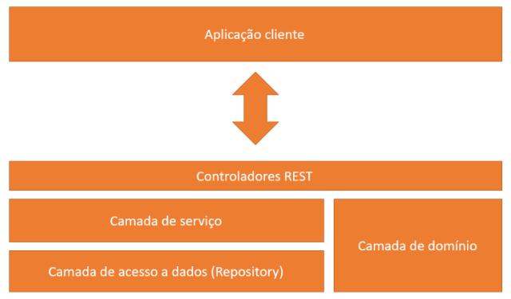

# UCDb

O UFCG Cursos database é uma aplicação para classificação e reviews de disciplinas de cursos da UFCG.

O UCDb disponibiliza um perfil para cada disciplina onde é possível realizar comentários e avaliações. Além disso, também é mostrado o ranking das disciplinas de acordo com o critério escolhido.

Os usuários irão construir conteúdo sobre as disciplinas de forma colaborativa através de comentários e likes nas disciplinas.

### Time to token expiration
Considerando que os alunos buscam compartilhar e receber informações sobre cadeiras que ainda vão pagar ou que estão pagando. Um tempo razoável para realização de todas suas ações então seria algo próximo dos 60 minutos.  Logo, foi definido o tempo de uma hora para expiração do token de acesso.

### API Docs

[Swagger](https://app.swaggerhub.com/apis/wesleymonte/UCDb/1.0)

# Architecture

  

*  Camada de Domínio: Classes do domínio(e.g.: Subject, Comment)
*  Camada de Acesso a Dados: Classes responsáveis por se comunicar com o banco de dados
*  Camada de Serviço: Classes que reúnem os métodos(serviços) de cada entidade domínio.
*  Controladores REST: Classes que mapeiam as requisições e os serviços.

# Requirements

* Java 8
* Maven

# Setting up

*  `git clone https://github.com/wesleymonte/UCDb-API.git`

*  `cd UCDb-API/`

*  `bash bin/start-service.sh`
